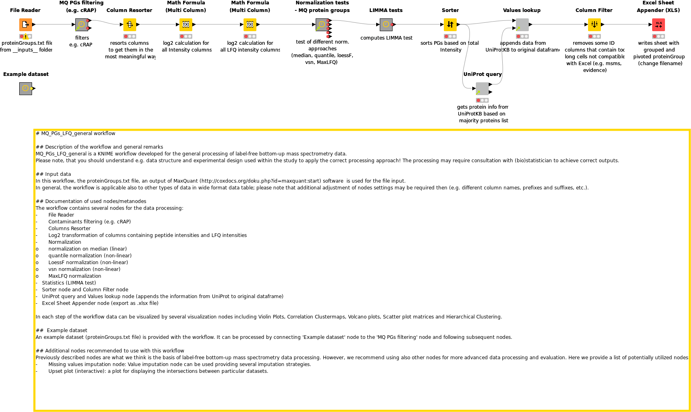

# MQ_PGs_LFQ_general workflow

## Description of the workflow and general remarks
MQ_PGs_LFQ_general is a KNIME workflow developed for the general processing of label-free bottom-up mass spectrometry data.
Please note, that you should understand e.g. data structure and experimental design used within the study to apply the correct processing approach! The processing may require consultation with (bio)statistician to achieve correct outputs.
## Documentation of used nodes/metanodes
The workflow contains several nodes for the data processing:
-	File Reader
-	Contaminants filtering (e.g. cRAP)
-   Columns Resorter
-	Log2 transformation of columns containing peptide intensities and LFQ intensities
-	Normalization
    -   normalization on median (linear)
    -   quantile normalization (non-linear)
    -   LoessF normalization (non-linear)
    -   vsn normalization (non-linear)
    -   MaxLFQ normalization
-   Statistics (LIMMA test)
-   Sorter node and Column Filter node
-   UniProt query and Values lookup node (appends the information from UniProt to original dataframe) 
-   Excel Sheet Appender node (export as .xlsx file)

In each step of the workflow data can be visualized by several visualization nodes including Violin Plots, Correlation Clustermaps, Volcano plots, Scatter plot matrices and Hierarchical Clustering.

##  Example dataset
An example dataset (proteinGroups.txt file) is provided with the workflow. It can be processed by connecting 'Example dataset' node to the 'MQ PGs filtering' node and following subsequent nodes. 

## Additional nodes recommended to use with this workflow
Previously described nodes are what we think is the basis of label-free bottom-up mass spectrometry data processing. However, we recommend using also other nodes for more advanced data processing and evaluation. Here we provide a list of potentially utilized nodes:
-	Value imputation node: imputation of missing (NaN) or zero values.  
-	Upset plot (interactive): a plot for displaying the intersections between particular datasets.

## Image of the workflow 

### Do you have a question?
In the case you have a question, please contact the [contact person](mailto:423436@mail.muni.cz) or create an issue [here](https://github.com/OmicsWorkflows/KNIME_workflows/issues/new)

## Changelog

##### 0.6a
- paths of all used metanode templates changed to point to the gitfolders folder so they now can be updated automatically