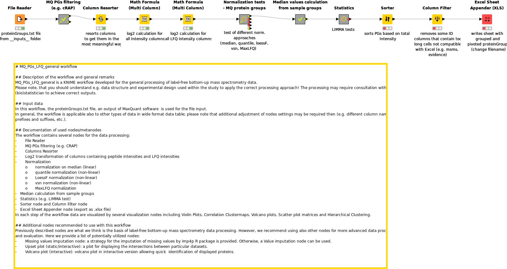

# MQ_PGs_LFQ_general workflow

## Description of the workflow and general remarks
MQ_PGs_LFQ_general is a KNIME workflow developed for the general processing of label-free bottom-up mass spectrometry data.
Please note, that you should understand e.g. data structure and experimental design used within the study to apply the correct processing approach! The processing may require consultation with (bio)statistician to achieve correct outputs.

## Input data
In this workflow, the proteinGroups.txt file, an output of [MaxQuant](http://coxdocs.org/doku.php?id=maxquant:start) software  is used for the file input. 
In general, the workflow is applicable also to other types of data in wide format data table; please note that additional adjustment of nodes settings may be required then (e.g. different column names, prefixes and suffixes, etc.).

## Documentation of used nodes/metanodes
The workflow contains several nodes for the data processing:
-	File Reader
-	Contaminants filtering (e.g. cRAP)
-   Columns Resorter
-	Log2 transformation of columns containing peptide intensities and LFQ intensities
-	Normalization
o	normalization on median (linear)
o	quantile normalization (non-linear)
o	LoessF normalization (non-linear)
o	vsn normalization (non-linear)
o	MaxLFQ normalization
-	Median calculation from sample groups
-   Statistics (e.g. LIMMA test)
-   Sorter node and Column Filter node
-   Excel Sheet Appender node (export as .xlsx file)

In each step of the workflow data are visualized by several visualization nodes including Violin Plots, Correlation Clustermaps, Volcano plots, Scatter plot matrices and Hierarchical Clustering.

## Additional nodes recommended to use with this workflow
Previously described nodes are what we think is the basis of label-free bottom-up mass spectrometry data processing. However, we recommend using also other nodes for more advanced data processing and evaluation. Here we provide a list of potentially utilized nodes:
-	Missing values imputation node: a strategy for the imputation of missing values by [imp4p](https://cran.r-project.org/web/packages/imp4p/index.html) R package is provided. Otherwise, a Value imputation node can be used providing several imputation strategies. The node should be used on log transformed data, prior to data normalization.
-	Upset plot (static/interactive): a plot for displaying the intersections between particular datasets.
-	Volcano plot (interactive): volcano plot in interactive version allowing quick  identification of displayed proteins.

## Image of the workflow 

### Do you have a question?
In the case you have a question, please contact the [responsible person](mailto:david.potesil@ceitec.muni.cz) or create an issue [here](https://github.com/OmicsWorkflows/KNIME_workflows/issues/new)
